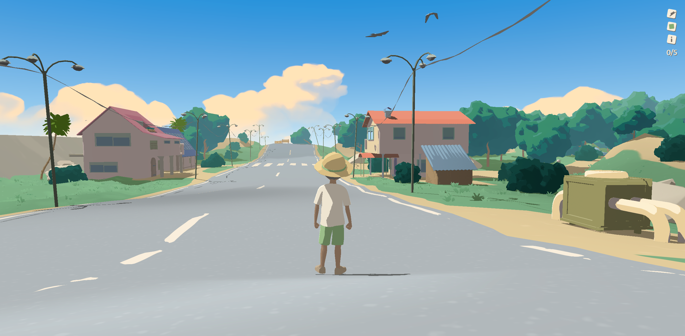

<h1 align="center">Guinomo</h1>
<p align="center">
 


</p>

A rewritten vanilla TypeScript port of **Guinomo**, the
WebGL art experiment by [Kivova],
rebuilt from a fully decompiled copy of the original deployed site.

> **Guinomo** 

## Run it

Requires [bun](https://bun.sh) (or npm, `package.json` scripts are compatible).

```bash
bun install
bun run dev        # dev server (HMR) at http://localhost:5173
bun run build      # tsc -b && vite build → dist/
bun run preview    # serve the production build at http://localhost:4173
bun run typecheck  # tsc -b --noEmit
```

There is no static deploy step: the app is always served by a Vite server
(dev server or `npm run preview`). The PHP page loads it via the
`GUINOMO_APP_SERVER` env var (see the integration section below).
 

## From the original to this port

The deployed site was a single page: one HTML file, two JavaScript chunks
(`index.js` entry + `App3D.js`, a 1.5 MB bundle), and ~97
static assets (geometries, textures, fonts, wasm transcoders, audio). No source
maps were published. This repo reproduces the same experience as typed,
modular code with no Svelte and no bundled vendors:

| Piece | Original | This repo |
|---|---|---|
| UI | Svelte 3 compiled components (App3D, Loader, Modal, UI, Button, Interactive, GenericInfo, Unsupported) | Plain DOM + GSAP (`src/components/ui.ts`) |
| Language | JavaScript (minified bundle) | **TypeScript**, typed, modular |
| Rendering | three.js r148 + three-mesh-bvh | npm `three@0.148.0` |
| Animation | GSAP 3.11.3 + CSSPlugin + CustomEase | npm `gsap@3.11.3` |
| Shaders | Embedded template strings in the bundle | **Verbatim `.glsl` files** (`src/scene/glsl/`, imported with `?raw`) |
| Formats | KTX2/Basis, Draco, custom `.bin` geometry (JSON header + interleaved binary) | Same, ported loaders |
| Networking | WebSocket multiplayer ("microrealm", room prefix `summer`, private relay server) | **P2P multiplayer over iroh-gossip** compiled to WebAssembly (`src/engine/multiplayer/iroh.ts` + Rust workspace in `multiplayer/`) |
| Audio | WebAudio, 5 looping tracks (forest / beach / footsteps / song / click1) | Same |
| Build | One Svelte chunk | Vite + bun, code-split worker chunk |

The experience: a loader → LUT-graded intro transition → an interactive summer
scene (walkable kid, sea, sky, birds, trees, grass, houses, UFO, alien, cats,
sloth…) with **5 hidden easter eggs** (the `0/5` counter in the corner).

## How this repo came to be

Everything here was recovered directly from the shipped artifact, no source
maps, no original sources, only minified code and binary assets:

1. **Recovery**, every file the site fetches was downloaded: both JS chunks,
   all `.bin` geometries, KTX2/PNG textures, fonts, transcoders and audio.
2. **Decompilation**, the 1.5 MB app bundle was de-minified, indexed at the
   statement level, and split into logical modules; the split was verified to
   reassemble **losslessly** back into the exact shipped module (byte-compared
   after re-minification, identical semantics, ~0.5 % delta from the original
   build's unrecoverable minifier settings). All 165 GLSL chunks embedded in the
   bundle were extracted as standalone shader files.
3. **Port**, the recovered modules were then read, understood, and re-written as typed, modular TypeScript: no Svelte (plain DOM + GSAP), no
   bundled vendors (npm packages), shaders as verbatim `.glsl` files.

What cannot be recovered from a compiled artifact: pre-minification variable
names, the original `.svelte` template sources (only compiled Svelte 3 output
exists), and the private multiplayer server implementation (the client protocol
was fully decoded instead). Everything else, scene, shaders, physics, audio,
UI, flow, is reproduced here.

## Multiplayer: pure P2P, one hardcoded room

Remote characters are now served by **iroh** (https://iroh.computer), a P2P
networking library compiled to WebAssembly, instead of the original's private
WebSocket relay (which is gone and rejects all clients). There is **no
application server, no rooms, and no join codes**: every client joins the same
hardcoded room.

How it works:

1. **The room** is a fixed 32-byte seed (`multiplayer/shared/src/lib.rs`,
   `ROOM_SEED`). It doubles as the gossip `TopicId` (the broadcast scope) and
   as the secret key of the room's rendezvous address on the public pkarr
   relay (`dns.iroh.link`).
2. **Rendezvous (zero signaling):** every client publishes its endpoint
   address (id + home relay) signed with the room key, and resolves the room
   key every 3 s. Whoever is in the room is found this way, no server needed
   to exchange "join codes".
3. **Gossip:** discovered peers are fed to the iroh-gossip swarm, which then
   maintains membership and broadcast trees on its own (HyParView/PlumTree).
   Every frame the local character publishes its `{p, r, a, seed}` state (26
   bytes), signed (ed25519) and sequenced, so only authenticated, fresh state
   is applied to remote characters.
4. **Transport:** browsers can't hole-punch (no UDP), so packets flow through
   n0's free public relays over WebSocket, end-to-end encrypted, and purely
   peer-to-peer in every other sense. If the page goes idle/hidden the client
   slows to a 1 Hz presence beacon instead of dropping out.

Multiplayer is enabled by default. Appending `?multiplayer=0` to the URL (also
accepts `false` or `off`) skips it entirely: the iroh WASM bundle is imported
dynamically, so it is only fetched when multiplayer is on and stays out of the
initial page load otherwise.

The Rust workspace lives in `multiplayer/` (`shared` = room logic,
`browser-wasm` = wasm-bindgen wrapper, `cli` = native tester). The compiled
wasm package is committed at `multiplayer/browser-wasm/pkg/` so Vercel deploys
never need a Rust toolchain. **Rebuilding is handled by CI** (`.github/workflows/build-wasm.yml`): it runs on every push that touches `multiplayer/**`
(or the build pipeline) with full caching, and commits the refreshed pkg back
to `main` — no releases or tags involved. Locally, `bun run build:wasm`
(requires [Rust](https://rustup.rs), [wasm-pack](https://rustwasm.github.io/wasm-pack/)
and clang/LLVM for the wasm target; both the script and the workflow share
`scripts/build-wasm.sh`). You can test the room from a terminal with
`cargo run -p summer-cli --release` inside `multiplayer/` — two instances
will discover each other exactly like two browser tabs.

## Architecture

**Boot flow**, `index.html` → `src/main.ts`: UA sniffing, WebGL2 capability
check (fallback message if missing), engine init (renderer + composer + input),
`MainController` mounts a fullscreen-triangle material, `EnvironmentScene`
loads its 24 subsystems in parallel, then the loader hides and the intro plays.

**Engine core** (`src/engine/`)
- `globals.ts`, the engine singleton: `WebGLRenderer` (no AA/stencil/depth,
  sRGB output) hidden inside a **closed shadow root** (the DOM shows no canvas),
  EffectComposer + SMAA + gamma pass, a shared `UniformsGroup` global clock
  (`resolution` / `time` / `dtRatio`) consumed by every custom shader, and an
  **adaptive DPR** controller that steps pixel ratio 0.7–1.0 to hold 30–60 fps.
- `scene.ts`, base scene with `beforeRenderCbs` (per-frame hooks) and a
  **warm-up upload pass**: renders everything into a dummy target twice so all
  shaders/textures are compiled and resident before the first real frame.
- `events.ts` / `input.ts` / `controls.ts`, the app's event bus (`webgl_*`
  events) wired to touch (virtual joystick, tap-to-jump), mouse, wheel, keyboard
  and gamepad input.
- `loaders/`, the custom `.bin` geometry format: 4-byte JSON header
  (attributes/layout) + interleaved binary payload, decoded via the bundled
  Draco/Basis wasm; plus `instancedPatches` (splits instances into per-patch
  meshes for frustum culling + LOD) and texture-animation/skin loaders.
- `physics.ts`, three-mesh-bvh accelerated sphere-vs-triangle collision with
  floor detection, position forces and damping (the kid walks the terrain).
- `sunlight.ts`, `FollowSunLight`: a directional sun that follows the camera
  and bakes a **cascaded shadow map** per LOD level (see fidelity notes).
- `audio.ts`, `AudioController`: 5 preloaded loops, positional listener,
  per-frame player-position updates, forest↔beach crossfade by world X.

**Scene modules** (`src/scene/`), `environmentScene.ts` composes 24 subsystems
(characters, sky, terrain, sea, birds, trees, bushes, lightposts, palmtrees,
houses, warehouses, machines, rocks, parasols, castles, grass, blockers, ufo,
alien, sign, cats, sloth, gossip), each a `SceneModule` exposing `ready`. The
sea is a 256px planar reflection; the birds are 25 GPU-computed particles
following baked curve paths with vertex-texture-animated flapping; grass bends
away from the character via shared `charPos`/`charSpeed` uniforms; the
ufo/alien/cats/sloth/gossip each hide one of the 5 secrets.

 

## Editing the character: `.bin` ↔ GLB round-trip

The kid's rigged geometry lives in `public/assets/geometries/` as a custom
`.bin` set: `kid.bin` (skinned mesh), `kid-bones.bin` (the 22-bone hierarchy)
and one `kid-<clip>.bin` per animation (`idle`, `run`, `air`, `bored`). These
are what the engine loads at runtime; `kid.glb` is only an **editing artifact**.

To edit the character in Blender and put the result back:

```bash
# .bin set → kid.glb (mesh + skeleton + clips)
node scripts/bins2glb.mjs kid --dir public/assets/geometries \
  --clips idle,run,air,bored --out kid.glb --draco <path-to-draco3d>

# … open kid.glb in Blender, edit, then export as glTF-Binary (.glb) …

# kid.glb → .bin set (rewrites public/assets/geometries/kid*.bin in place)
node scripts/glb2bins.mjs kid.glb --schema public/assets/geometries \
  --out public/assets/geometries --draco <path-to-draco3d> --verify
```

Both scripts need a `draco3d` package (encoder + decoder); it is not vendored,
so pass `--draco <dir>`. `glb2bins` preserves the attribute schema of the
existing `.bin` files, so the loader needs **no code change**:

- keep the **22 bones** with the same names and order (a bone's index in the
  skin is its `.bin` index; reordering, adding or removing bones breaks the rig);
- keep the four actions named `idle` / `run` / `air` / `bored` (override the
  mapping with `--clips key=Action,...`);
- keep the vertex color `COLOR_0` (the `colorInfo` zone — padded VEC2→VEC3 on
  export, truncated back on import). If it is dropped, `glb2bins` fails loudly
  instead of guessing.

Then run the gate (`typecheck`, `lint`, `vitest`, `build`, `check:bundle`) and
commit the changed `public/assets/geometries/kid*.bin`.

## Layout

```
src/
├── core/            # client (UA), events, deferred, math, ticker/clock
├── engine/          # renderer/composer/adaptive-DPR, scene, cameras, input,
│                    # physics (BVH), characters, particles (GPU), sunlight (CSM),
│                    # audio, loaders (bin/geometries/instancing/textures), multiplayer
├── scene/           # mainController, environmentScene, materials, shaders-post,
│                    # sky, sea, terrain, birds, vegetation, structures, setpieces,
│                    # characters + glsl/ (verbatim shader files)
└── components/      # ui.ts, plain-DOM UI (loader, nav, easter counter, modals)

multiplayer/         # Rust workspace: iroh P2P room (see section above)
├── shared/          # SummerNode: endpoint + gossip + pkarr room beacon
├── browser-wasm/    # wasm-bindgen wrapper → pkg/ (committed, consumed as `guinomo-browser`)
└── cli/             # native tester that joins the same room from a terminal
```

## PHP Social Network Integration

This port has been customized to integrate with a PHP-based social network (Noop.com) located at `rede-social-dev`.

- **Authentication:** Uses PHP native sessions (`$_SESSION['hashtag_uid']`). The engine identifies the owner via the `is_owner` flag in the DNA response.
- **Backend API:** 
  - `php/avatar.php`: Serves user DNA (colors, username, hat visibility).
  - `php/save_avatar_3d.php`: Secure endpoint for persisting 3D customization back to the MySQL database.
- **Customization:** Added a bidirectional sync for the `hat_visible` attribute, toggleable via the **H** key or a custom UI button (exclusive to the avatar owner).
- **Data Source:** Fetches real user identity and color preferences from the `user_avatar_config` and `usuarios` tables.
- **App hosting:** There is no static build committed to the site (the old `avatar-3d/` folder is gone). `guinomo.php` fetches the app's `index.html` from the Vite server configured by `GUINOMO_APP_SERVER` (default `http://localhost:5173`, the dev server; use `http://localhost:4173` for `npm run preview`, or the public URL Caddy proxies to) and injects the user identity/CSRF into it. It also sets `window.GUINOMO_ASSET_BASE` to that server so geometry, decoder, texture, audio, and font requests resolve against it.

## Credits & disclaimer

- Original experience: **Guinomo**
- All 3D assets, textures, audio, fonts and the original code belong to their
  respective authors; this is a reverse-engineering and learning project,
  not affiliated with or endorsed by the original author.
- The original was decompiled for study; the code here was re-written from that study. If you are the original author and would like this removed, please open an issue.
